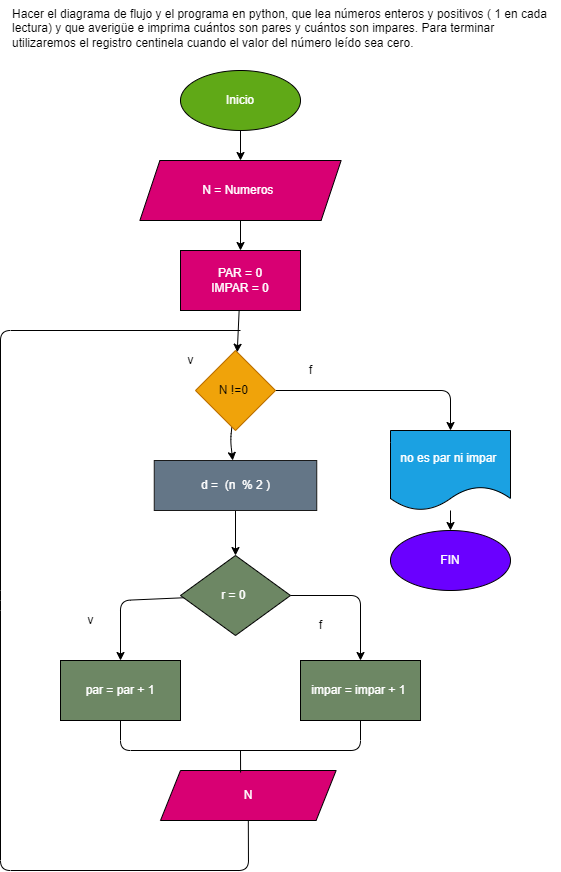

# hacer el diagrama de flujo y el programa en python  

Hacer el diagrama de flujo y el programa en python, que lea números enteros y positivos ( 1 en cada lectura) y que averigüe e imprima cuántos son pares y cuántos son impares. Para terminar utilizaremos el registro centinela cuando el valor del número leído sea cero.

## Diagrama de flujo__

 "Diagrama de flujo")